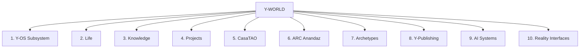

# Y-WORLD Architecture

## 1. Subsystems Map

## 2. Layer Definitions

| Region | Folder | Purpose | Key Artifacts |
| :--- | :--- | :--- | :--- |
| **00_System** | `00_System/` | Core configuration, principles, and system metadata. | Operating Principles, Metadata Schema |
| **01_Cockpit** | `01_Cockpit/` | Main entry points and daily review surfaces. | HOME.md, Command Center |
| **02_Maps** | `02_Maps/` | Spatial semantic control maps. | Y-WORLD ROOT MAP, Submaps |
| **03_Dashboards**| `03_Dashboards/` | Dynamic data views and loop trackers. | Y-WORLD Dashboard, Y-OS Dashboard |
| **04_Templates** | `04_Templates/` | Blueprints for note creation. | Template - K-Card, Template - Project |
| **05_Registries** | `05_Registries/` | Tool, plugin, and asset indexes. | Plugin Registry, Tool Registry |
| **06_Workflows** | `06_Workflows/` | n8n, local, and agent automation rules. | Workflow Registry |
| **07_Agent_Ops** | `07_Agent_Operations/`| Manus operating parameters and safety. | Manus Operating Manual, Task Queue |
| **10_Inbox** | `10_Inbox/` | Quick capture landing zone. | Unsorted notes, temporary clips |
| **20_Life** | `20_Life/` | Personal routines, finance, health, travel. | Life Dashboard, Routies |
| **30_Knowledge** | `30_Knowledge/` | Dynamic semantic knowledge base. | Knowledge Dashboard, References |
| **40_K-Cards** | `40_K-Cards/` | Atomized structured knowledge blocks. | K-Cards |
| **50_Projects** | `50_Projects/` | Active, paused, and future initiatives. | Project notes, Project logs |
| **60_Y-OS** | `60_Y-OS/` | Cognitive layer configuration. | Y-OS Dashboard, routing tables |
| **70_CasaTAO** | `70_CasaTAO/` | AI-native house automation (Sicily). | CasaTAO Dashboard, Home Assistant |
| **71_ARC_Anandaz**| `71_ARC_Anandaz/` | Swiss chalet retreat planning. | ARC Dashboard, Local Ecosystem |
| **80_Archetypes** | `80_Archetypes/` | Universal symbolic grammar & dreams. | Archetypes Dashboard, Visual Atlas |
| **81_Y-Publishing**| `81_Y-Publishing/` | Publishing engine and media products. | Y-Publishing Dashboard, Book drafts |
| **90_Interfaces** | `90_Reality_Interfaces/`| Web/Mobile portal & physical maps. | Y-WORLD.net Vision, Dashboards |
| **99_Archive** | `99_Archive/` | Completed projects and legacy notes. | Archived files |
