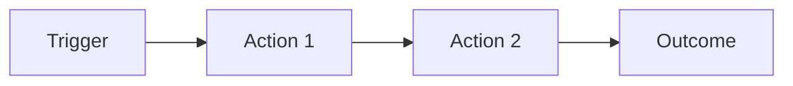

# Workflow: {{title}}

## 🔄 Flow Diagram

```mermaid
graph LR
    Trigger[Trigger] --> Step1[Action 1] --> Step2[Action 2] --> End[Outcome]
```

## ⚙️ Parameters
* **Trigger Type**: webhook / cron / event
* **Source**: n8n / Local REST API
* **Target**:
